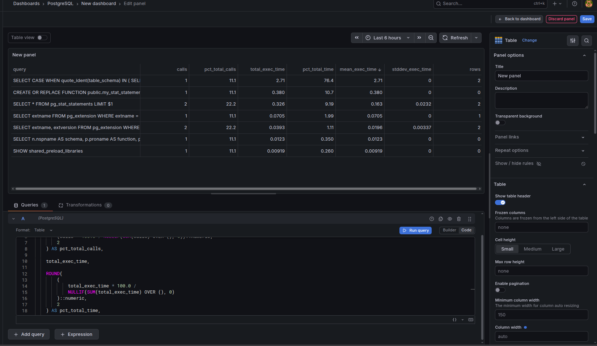

# PostgreSQL 17 + Grafana OSS + pg_stat_statements Homelab

For this setup I’m using:

* PostgreSQL 17
* Grafana OSS
* Docker Compose
* Persistent Docker volumes
* A dedicated `grafana_reader` PostgreSQL user
* `pg_stat_statements`
* A Grafana dashboard showing query count, total time, mean time, rows, and percentages

One thing worth mentioning before starting: modern PostgreSQL versions use `total_exec_time`, `mean_exec_time`, etc. instead of the older `total_time` / `mean_time` column names. So I’ll use the current column names here.

---

# 1. Create the homelab directory

First I’m creating a directory for the whole setup:

```bash
mkdir -p ~/homelab/postgres-grafana
cd ~/homelab/postgres-grafana

mkdir -p postgres/init
mkdir -p grafana/provisioning/datasources
mkdir -p grafana/provisioning/dashboards
mkdir -p grafana/dashboards
```

The directory structure should look like this:

```text
homelab/
└── postgres-grafana/
    ├── docker-compose.yml
    ├── .env
    ├── postgres/
    │   └── init/
    │       └── 01-init.sql
    └── grafana/
        ├── provisioning/
        │   ├── datasources/
        │   │   └── postgres.yml
        │   └── dashboards/
        │       └── dashboards.yml
        └── dashboards/
            └── pg-stat-statements.json
```

---

# 2. Create the environment file

I’m keeping the passwords in `.env` instead of putting them directly into the Compose file.

Create it with:

```bash
nano .env
```

Put this in:

```env
POSTGRES_DB=homelab
POSTGRES_USER=postgres
POSTGRES_PASSWORD=change-this-postgres-password

GRAFANA_DB_USER=grafana_reader
GRAFANA_DB_PASSWORD=change-this-grafana-password

GRAFANA_ADMIN_USER=admin
GRAFANA_ADMIN_PASSWORD=change-this-grafana-admin-password
```

I’d use strong passwords here.

For example:

```env
POSTGRES_PASSWORD=some-long-random-password
GRAFANA_DB_PASSWORD=another-long-random-password
GRAFANA_ADMIN_PASSWORD=yet-another-long-random-password
```

Then lock down the file:

```bash
chmod 600 .env
```

---

# 3. Create Docker Compose

Create the Compose file:

```bash
nano docker-compose.yml
```

Use:

```yaml
services:

  postgres:
    image: postgres:17
    container_name: homelab-postgres
    restart: unless-stopped

    environment:
      POSTGRES_DB: ${POSTGRES_DB}
      POSTGRES_USER: ${POSTGRES_USER}
      POSTGRES_PASSWORD: ${POSTGRES_PASSWORD}

    command:
      - postgres
      - -c
      - shared_preload_libraries=pg_stat_statements
      - -c
      - pg_stat_statements.track=all
      - -c
      - pg_stat_statements.max=10000

    volumes:
      - postgres_data:/var/lib/postgresql/data
      - ./postgres/init:/docker-entrypoint-initdb.d:ro

    ports:
      - "5432:5432"

    healthcheck:
      test:
        [
          "CMD-SHELL",
          "pg_isready -U ${POSTGRES_USER} -d ${POSTGRES_DB}"
        ]
      interval: 10s
      timeout: 5s
      retries: 5

    networks:
      - homelab


  grafana:
    image: grafana/grafana-oss:latest
    container_name: homelab-grafana
    restart: unless-stopped

    environment:
      GF_SECURITY_ADMIN_USER: ${GRAFANA_ADMIN_USER}
      GF_SECURITY_ADMIN_PASSWORD: ${GRAFANA_ADMIN_PASSWORD}

      GF_USERS_ALLOW_SIGN_UP: "false"

    ports:
      - "3000:3000"

    volumes:
      - grafana_data:/var/lib/grafana

      - ./grafana/provisioning:/etc/grafana/provisioning:ro

      - ./grafana/dashboards:/var/lib/grafana/dashboards:ro

    depends_on:
      postgres:
        condition: service_healthy

    networks:
      - homelab


volumes:
  postgres_data:
  grafana_data:


networks:
  homelab:
```

### Why the `command` section?

This is basically the Docker version of adding this to `postgresql.conf`:

```conf
shared_preload_libraries = 'pg_stat_statements'
```

The important part is that `pg_stat_statements` needs to be loaded when PostgreSQL starts.

---

# 4. Create the PostgreSQL initialization script

Next I’m creating the initialization script:

```bash
nano postgres/init/01-init.sql
```

Put this in:

```sql
-- Enable pg_stat_statements
CREATE EXTENSION IF NOT EXISTS pg_stat_statements;

-- Create a dedicated user for Grafana
CREATE USER grafana_reader
WITH PASSWORD 'change-this-grafana-password';

-- Allow Grafana to connect to the database
GRANT CONNECT ON DATABASE homelab TO grafana_reader;

-- Allow the user to access the public schema
GRANT USAGE ON SCHEMA public TO grafana_reader;


-- Function exposing pg_stat_statements
--
-- SECURITY DEFINER means this function executes with the
-- privileges of its owner rather than the caller.

CREATE OR REPLACE FUNCTION public.my_stat_statements()
RETURNS SETOF pg_stat_statements
LANGUAGE SQL
SECURITY DEFINER
SET search_path = pg_catalog
AS $$
    SELECT *
    FROM public.pg_stat_statements;
$$;


-- Only allow Grafana to execute this function
GRANT EXECUTE
ON FUNCTION public.my_stat_statements()
TO grafana_reader;


-- Make sure nobody can accidentally execute this as PUBLIC
REVOKE EXECUTE
ON FUNCTION public.my_stat_statements()
FROM PUBLIC;
```

There is one thing I need to change here before starting the containers.

The password:

```sql
WITH PASSWORD 'change-this-grafana-password';
```

needs to match the `GRAFANA_DB_PASSWORD` from `.env`.

For example, if I have:

```env
GRAFANA_DB_PASSWORD=my-super-secret-password
```

then the SQL should contain:

```sql
CREATE USER grafana_reader
WITH PASSWORD 'my-super-secret-password';
```

---

# 5. One security improvement

The function should ideally be owned by a sufficiently privileged role.

Since this initialization script runs as the PostgreSQL superuser, the function will initially be owned by `postgres`.

That's what I want here.

The important parts are:

```sql
SECURITY DEFINER
```

and:

```sql
SET search_path = pg_catalog
```

The `search_path` setting is useful here because `SECURITY DEFINER` functions need some care around search-path handling.

---

# 6. Configure Grafana's PostgreSQL datasource

Now I’m setting up the PostgreSQL datasource for Grafana.

Create:

```bash
nano grafana/provisioning/datasources/postgres.yml
```

Use:

```yaml
apiVersion: 1

datasources:

  - name: PostgreSQL
    type: postgres
    access: proxy

    url: postgres:5432

    user: grafana_reader

    secureJsonData:
      password: change-this-grafana-password

    jsonData:
      database: homelab
      sslmode: disable
      postgresVersion: 1700
      timescaledb: false

    isDefault: true
```

Again, the password needs to match the one used for `grafana_reader`.

One Docker-specific thing here is the hostname:

```text
postgres:5432
```

I’m not using:

```text
localhost:5432
```

because Grafana is connecting to PostgreSQL from another container. Docker's internal DNS resolves the `postgres` service name to the PostgreSQL container.

---

# 7. Configure dashboard provisioning

Create:

```bash
nano grafana/provisioning/dashboards/dashboards.yml
```

Use:

```yaml
apiVersion: 1

providers:

  - name: PostgreSQL
    orgId: 1

    folder: PostgreSQL

    type: file

    disableDeletion: false
    editable: true

    options:
      path: /var/lib/grafana/dashboards
```

This tells Grafana to load dashboards from:

```text
grafana/dashboards/
```

---

# 8. Start everything

From:

```text
~/homelab/postgres-grafana
```

run:

```bash
docker compose up -d
```

Then check the containers:

```bash
docker compose ps
```

I should see something similar to:

```text
NAME                  STATUS
homelab-postgres      Up
homelab-grafana       Up
```

I can also check the logs if something doesn't look right:

```bash
docker logs homelab-postgres
```

and:

```bash
docker logs homelab-grafana
```

---

# 9. Verify pg_stat_statements

I’m going to connect to PostgreSQL from the container:

```bash
docker exec -it homelab-postgres \
  psql -U postgres -d homelab
```

Then:

```sql
SELECT * FROM pg_stat_statements LIMIT 1;
```

I should get a row back.

I can also check the main statistics with:

```sql
SELECT
    query,
    calls,
    total_exec_time,
    mean_exec_time,
    rows
FROM pg_stat_statements
ORDER BY calls DESC
LIMIT 10;
```

---

# 10. Verify the security-definer function

Still inside `psql`, I can test the function:

```sql
SELECT
    query,
    calls,
    total_exec_time,
    mean_exec_time,
    rows
FROM my_stat_statements()
ORDER BY calls DESC
LIMIT 10;
```

I should get results here as well.

Now I’ll test it using the Grafana user:

```bash
docker exec -it homelab-postgres \
  psql -U grafana_reader -d homelab
```

Then:

```sql
SELECT
    query,
    calls,
    total_exec_time,
    mean_exec_time,
    rows
FROM my_stat_statements()
ORDER BY calls DESC
LIMIT 10;
```

The main thing I’m checking here is that `grafana_reader` can read the statistics without being a PostgreSQL superuser.

Running:

```sql
\du
```

should show something conceptually like:

```text
postgres          Superuser
grafana_reader
```

---

# 11. Open Grafana

I can now open:

```text
http://YOUR-SERVER-IP:3000
```

For example:

```text
http://192.168.1.100:3000
```

I’ll log in with:

```text
Username: admin
Password: the GRAFANA_ADMIN_PASSWORD from .env
```

The PostgreSQL datasource should already be provisioned.

In Grafana, go to:

**Connections → Data sources → PostgreSQL**

and click:

**Save & test**

I should get:

```text
Database Connection OK
```

---

# 12. Create the query-statistics dashboard

I can now create the dashboard manually.

Go to:

**Dashboards → New → New dashboard → Add visualization**

Select:

```text
PostgreSQL
```

For the query, use:

```sql
SELECT
    query,
    calls,

    ROUND(
        (calls * 100.0 / NULLIF(SUM(calls) OVER (), 0))::numeric,
        2
    ) AS pct_total_calls,

    total_exec_time,

    ROUND(
        (
            total_exec_time * 100.0 /
            NULLIF(SUM(total_exec_time) OVER (), 0)
        )::numeric,
        2
    ) AS pct_total_time,

    mean_exec_time,
    stddev_exec_time,
    rows

FROM public.my_stat_statements()

ORDER BY calls DESC;
```

I’ll use:

```text
Table
```

as the visualization.

The result should look something like this:



---

# 13. Make the table more useful

Instead of having one big table for everything, I’d rather have three panels.

## Panel 1 — Most executed queries

```sql
SELECT
    query,
    calls,
    ROUND(
        calls * 100.0 /
        NULLIF(SUM(calls) OVER (), 0),
        2
    ) AS pct_calls,
    mean_exec_time,
    total_exec_time
FROM my_stat_statements()
ORDER BY calls DESC
LIMIT 50;
```

Visualization:

```text
Table
```

---

## Panel 2 — Queries consuming the most database time

```sql
SELECT
    query,
    calls,
    total_exec_time,
    mean_exec_time,

    ROUND(
        (
            total_exec_time * 100.0 /
            NULLIF(SUM(total_exec_time) OVER (), 0)
        )::numeric,
        2
    ) AS pct_total_time

FROM public.my_stat_statements()

ORDER BY total_exec_time DESC

LIMIT 50;
```

This is probably the most useful panel for me.

A query doesn't necessarily need to run thousands of times to be a problem. It might only run 100 times but still consume most of the database execution time.

---

## Panel 3 — Slowest queries

```sql
SELECT
    query,
    calls,
    mean_exec_time,
    stddev_exec_time,
    total_exec_time,
    rows
FROM my_stat_statements()
WHERE calls > 0
ORDER BY mean_exec_time DESC
LIMIT 50;
```

This makes it easier to find queries with a high average execution time.

---

# 14. Add some test workload

If the database is basically empty, there won't be much interesting data in `pg_stat_statements`.

I can create some test data to generate some queries.

First:

```bash
docker exec -it homelab-postgres \
  psql -U postgres -d homelab
```

Then:

```sql
CREATE TABLE IF NOT EXISTS test_data (
    id BIGSERIAL PRIMARY KEY,
    name TEXT,
    value INTEGER
);

INSERT INTO test_data (name, value)
SELECT
    md5(random()::text),
    floor(random() * 1000)::integer
FROM generate_series(1, 100000);

SELECT COUNT(*) FROM test_data;

SELECT AVG(value) FROM test_data;

SELECT *
FROM test_data
WHERE value > 900
ORDER BY value DESC
LIMIT 100;

SELECT name, COUNT(*)
FROM test_data
GROUP BY name
ORDER BY COUNT(*) DESC
LIMIT 10;
```

After running these, I can refresh the Grafana dashboard.

The queries should start showing up in `pg_stat_statements`.

---

# 15. Test query percentages

I can also check the percentages directly from PostgreSQL:

```sql
SELECT
    query,
    calls,
    ROUND(
        calls * 100.0 /
        NULLIF(SUM(calls) OVER (), 0),
        2
    ) AS pct_total_calls,

    ROUND(
        total_exec_time * 100.0 /
        NULLIF(SUM(total_exec_time) OVER (), 0),
        2
    ) AS pct_total_time,

    total_exec_time,
    mean_exec_time,
    stddev_exec_time,
    rows

FROM my_stat_statements()

ORDER BY total_exec_time DESC;
```

The output will look something like:

```text
query                         calls   pct_calls   pct_time   total   mean
---------------------------   -----   ---------   --------   -----   ----
SELECT ...                     5000      61.42      74.91   12000   2.40
SELECT ...                     2000      24.56      12.33    1974   0.98
UPDATE ...                      700       8.60       8.12    1300   1.85
...
```

This gives me a quick way of seeing which queries are responsible for most of the execution time.

---

# 16. Reset statistics

If I want to start measuring from a clean slate, I can reset the statistics:

```sql
SELECT pg_stat_statements_reset();
```

Or directly from the host:

```bash
docker exec -it homelab-postgres \
  psql -U postgres -d homelab \
  -c "SELECT pg_stat_statements_reset();"
```

After that I can let the applications run for a while and then check the dashboard again.

---

# 17. The architecture

The setup currently looks like this:

```text
                         LAN
                          │
                          │
                    ┌─────▼─────┐
                    │  Grafana  │
                    │   :3000   │
                    └─────┬─────┘
                          │
                          │ PostgreSQL
                          │
                Docker network
                          │
                    ┌─────▼─────┐
                    │ PostgreSQL│
                    │   :5432   │
                    │           │
                    │ pg_stat_  │
                    │ statements│
                    └─────┬─────┘
                          │
                     PostgreSQL
                        volume
```

Grafana accesses the statistics through the dedicated user:

```text
grafana_reader
      │
      ▼
my_stat_statements()
      │
      ▼
pg_stat_statements
```

rather than giving Grafana the PostgreSQL superuser:

```text
Grafana
   │
   ▼
postgres superuser
```

I don't want to give Grafana superuser credentials just to read query statistics.

---

# 18. Docker networking detail

From the host, PostgreSQL is available at:

```text
localhost:5432
```

From Grafana, PostgreSQL is available at:

```text
postgres:5432
```

That's because Docker's internal DNS resolves:

```text
postgres
```

to the PostgreSQL container.

If I only need PostgreSQL to be accessed by other containers, I can also remove:

```yaml
ports:
  - "5432:5432"
```

from the PostgreSQL service.

Grafana will still be able to connect through:

```text
postgres:5432
```

For this homelab, I'd actually prefer doing that if nothing outside Docker needs direct access to PostgreSQL.

---

# 19. Final Compose configuration

For the more locked-down version, this is the Compose configuration I’d use:

```yaml
services:

  postgres:
    image: postgres:17
    container_name: homelab-postgres
    restart: unless-stopped

    environment:
      POSTGRES_DB: ${POSTGRES_DB}
      POSTGRES_USER: ${POSTGRES_USER}
      POSTGRES_PASSWORD: ${POSTGRES_PASSWORD}

    command:
      - postgres
      - -c
      - shared_preload_libraries=pg_stat_statements
      - -c
      - pg_stat_statements.track=all
      - -c
      - pg_stat_statements.max=10000

    volumes:
      - postgres_data:/var/lib/postgresql/data
      - ./postgres/init:/docker-entrypoint-initdb.d:ro

    healthcheck:
      test:
        [
          "CMD-SHELL",
          "pg_isready -U ${POSTGRES_USER} -d ${POSTGRES_DB}"
        ]
      interval: 10s
      timeout: 5s
      retries: 5

    networks:
      - homelab


  grafana:
    image: grafana/grafana-oss:latest
    container_name: homelab-grafana
    restart: unless-stopped

    environment:
      GF_SECURITY_ADMIN_USER: ${GRAFANA_ADMIN_USER}
      GF_SECURITY_ADMIN_PASSWORD: ${GRAFANA_ADMIN_PASSWORD}
      GF_USERS_ALLOW_SIGN_UP: "false"

    ports:
      - "3000:3000"

    volumes:
      - grafana_data:/var/lib/grafana
      - ./grafana/provisioning:/etc/grafana/provisioning:ro
      - ./grafana/dashboards:/var/lib/grafana/dashboards:ro

    depends_on:
      postgres:
        condition: service_healthy

    networks:
      - homelab


volumes:
  postgres_data:
  grafana_data:


networks:
  homelab:
```

So the final setup is basically:

```text
Internet/LAN
     │
     ▼
  Grafana :3000
     │
     │ Docker network
     ▼
 PostgreSQL
     │
     ├── pg_stat_statements
     │
     └── persistent volume
```

This gives me PostgreSQL 17 running in Docker, persistent data, `pg_stat_statements`, a separate read-only-style Grafana database account, and Grafana panels for looking at query counts and execution time.